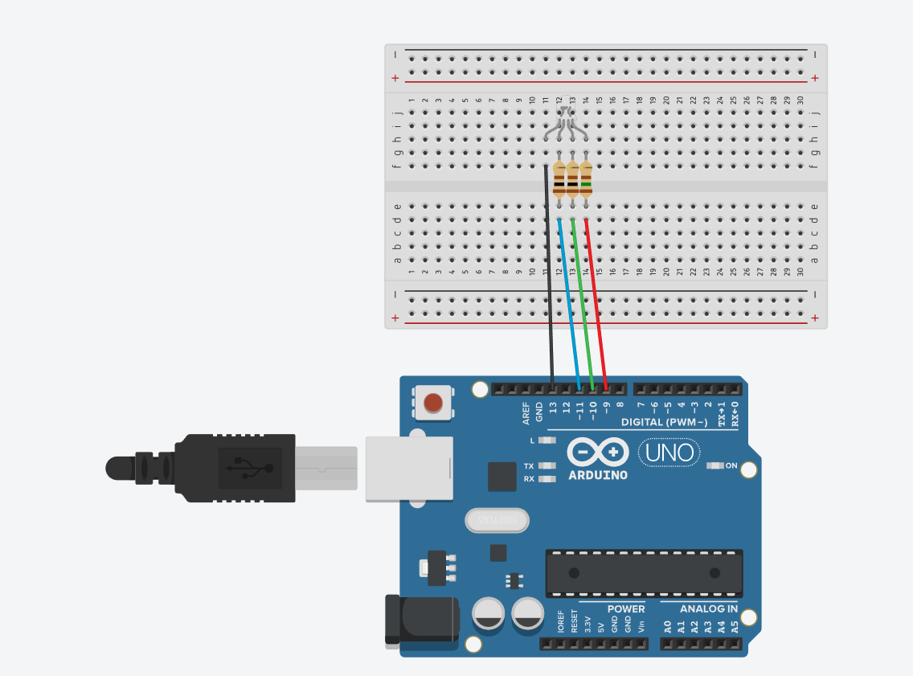
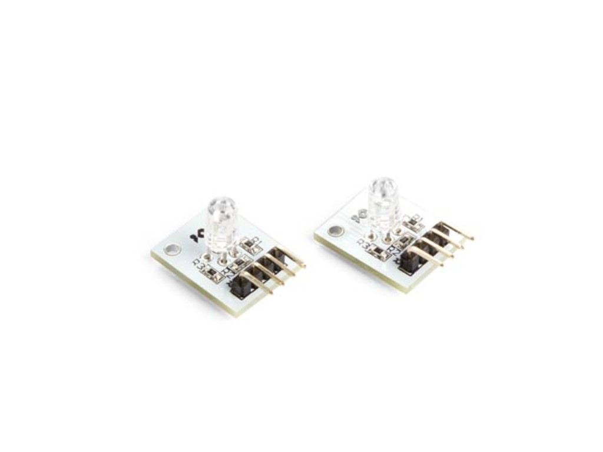

## LED RGB avec VSCode & PlatFormIO : Code POO avec Ticker [ Work in Progress ] 


### <ins>Rsc :</ins>

* Langage C/CPP via [PlatFormIO](https://platformio.org/platformio-ide) [ Greffon VSCode ]
* Coté librairie, Ticker.h de [Stefan Staub](https://github.com/sstaub/Ticker) téléchargée et installée san peine dans PIO, section *"librairies"* ou dans le dossier 'lib' du projet.
* Une LED RGB à cathode [ Dans mon cas un module Velleman VMA-307 qui fait très bien le job ]
* Sinon, sans ce module : 3 x résistances, 150Ω [ Rouge ], 100Ω [ vert et bleu ] et une LED RGB à cathode
* Enfin un µControleur [Arduino](https://www.e-techno-tutos.com/2018/05/28/arduino-brochage/) ( ou autre...mais code ci apres à adapter )

*`Et...l'esprit de la bidouille !`* 

### <ins>Specs :</ins>

La LED RGB à `cathode a la particularité de recevoir la masse sur sa broche la plus longue.`</br> Tandis que les 3 autres controlent les signaux RGB via la masse [ Signal 'HIGH'/1 ou modulé en ~pwm ]   
Les signaux se combinent et la led ne limite pas à trois couleurs : Rouge, Vert et Bleu.</br>
En digital pur 0 ou 1 [ 0 : Allumée, 1 : Eteint ] avec 3 fils on a `2³ = 8 possibilités [ soit 7 couleurs et une à Off ! ]`</br>
Quand en *'analogique' simulé*, le PWM : on a 256 possibilités de signaux.</br>
Ce qui donne pour trois canaux, 256³ => `16 777 216 nuances !`

### <ins>Le brochage: </ins>
 
`R  |  G  |  B  | Masse(GND)`
               
Avec le module VMA-307, c'est le brochage qui me correspond( *avantage du module : pas besoin de jouer avec des resistances* )

Le VMA-307 : 



*Avec une LED RGB standard, je pense que nous aurions plutot besoin des resistance suivantes :*

* *Rouge : 3V[5V-(1.8+2.2)/2]   / 0.02A[20mA] => 150Ω*
* *Vert  : 1.8V[5V-(3.2+3.4)/2] / 0.02A       =>  90Ω*
* *Bleu  : 1.8V[5V-(3.2+3.4)/2] / 0.02A       =>  90Ω*

*`Ce qui ajusterait grandement la précision des couleurs en Analogique.`*

## Code - Morceaux choisis


```cpp 

```